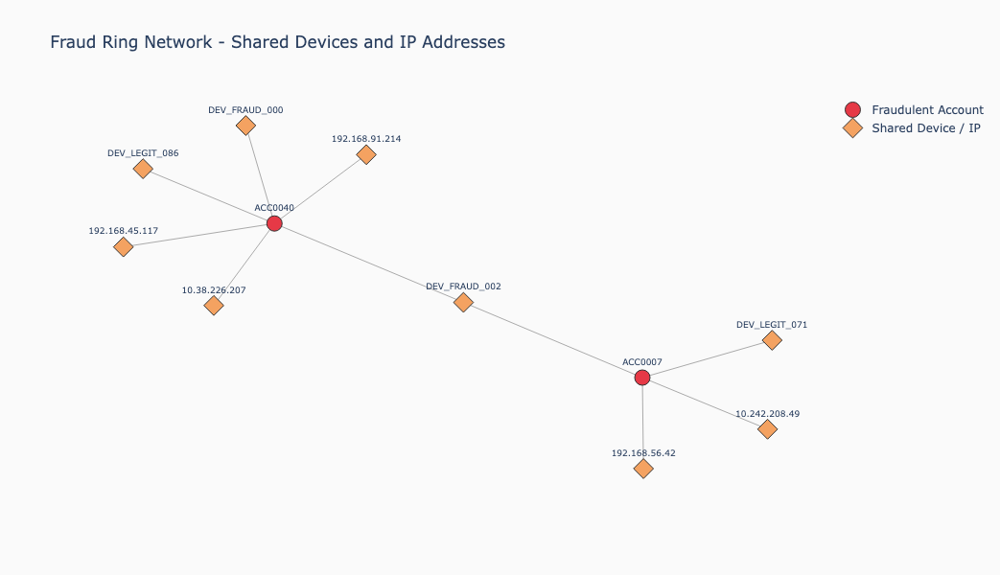
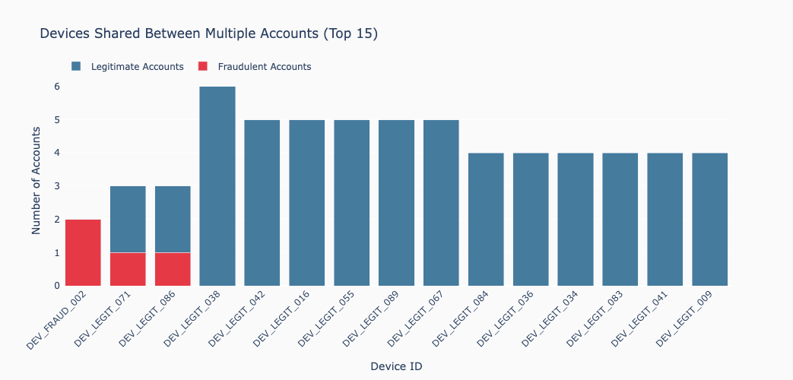

# Day 5: Neo4j

## What Is It?

Neo4j is the world's leading graph database. Where relational databases store data in rows and columns and document databases store data as JSON-like objects, Neo4j stores data as nodes and relationships. Every entity becomes a node and every connection between entities becomes a first-class relationship with its own properties. This makes the structure of the data as queryable as the data itself.

Neo4j uses Cypher as its query language - a declarative, pattern-matching language designed specifically for graphs. A Cypher query describes the shape of the data a user is looking for and Neo4j finds all instances of that pattern in the graph. Traversing relationships in Neo4j is a native operation, not a join. This makes multi-hop queries - follow this account to its transactions, then to the devices those transactions used, then to other accounts that used the same devices - fast and natural to express.

Today, Neo4j supports native vector indexes via Cypher. Embeddings are stored as properties on nodes and vector similarity search uses the same index infrastructure as the rest of the database. This means graph traversal and vector search can be combined in a single Cypher query - no separate system, no result merging in application code.

## When Would You Reach for It?

The clearest signal is connected data where relationships carry meaning. If the interesting questions in your domain are not just "what does this entity look like" but "who is this entity connected to and what does that network tell us" - graph is the right model.

The second signal is multi-hop traversal. Relational databases can express joins, but deeply nested joins across many hops are expensive and awkward to write. In Neo4j, traversing five hops across a network is as natural as traversing one.

The third signal is the combination of similarity and connectivity. Vector search tells us what things look like similar to. Graph traversal tells us what things are connected to. Fraud detection, recommendation engines, knowledge graphs and supply chain analysis all benefit from both signals simultaneously. Neo4j is one of the few database systems where we can express that combination in a single query.

## The Use Case

For this chapter we'll build a fraud detection system that combines vector similarity search with graph traversal. The dataset models bank accounts, transactions, devices and IP addresses. Fraudulent accounts share devices and IP addresses with each other - a pattern that reveals coordinated fraud rings.

The chapter demonstrates three distinct approaches and why each alone is insufficient:

- **Pure vector search** - finds transactions that look semantically similar to known fraud patterns. In our dataset, vector search alone fails to surface the fraudulent transactions because their descriptions are not semantically distinct enough from legitimate ones.
- **Pure graph traversal** - starting from a known fraudulent account, traverses the graph to find all accounts sharing devices or IP addresses. This reveals the fraud ring structure without any vector search.
- **Combined graph and vector** - uses vector search to find semantically suspicious transactions, then traverses the graph from each result to find connected accounts. This surfaces fraud rings that neither approach could find alone.

## The Data

We generate a synthetic fraud detection dataset with five node types and four relationship types.

Node types:

- `Account` - a bank account with an account type (checking, savings, business, student) and a fraud flag
- `Transaction` - a purchase with an amount, merchant category, merchant name and a prose description; the description is what we embed
- `Device` - a device ID used to initiate a transaction
- `IpAddress` - a network address used during a transaction
- `Merchant` - a fictional merchant name

Relationship types:

- `(:Account)-[:MADE]->(:Transaction)`
- `(:Transaction)-[:USED_DEVICE]->(:Device)`
- `(:Transaction)-[:FROM_IP]->(:IpAddress)`
- `(:Transaction)-[:AT_MERCHANT]->(:Merchant)`

The fraud rate is controlled by `FRAUD_RATE = 0.05` - approximately 5% of accounts are fraudulent, which reflects real-world conditions. Fraudulent accounts are assigned shared fraud devices (`DEV_FRAUD_*`) and shared IP addresses. Legitimate accounts use their own unique devices and IPs. This creates a detectable fraud ring in the graph that graph traversal can surface.

The dataset scales via `NUM_ACCOUNTS` and `NUM_TRANSACTIONS` while maintaining the fraud proportion automatically.

## Building the Application

### Prerequisites

To follow along you'll need:

- A Neo4j AuraDB account
- Ollama running locally with the `all-minilm` model pulled
- Python 3.12 with a virtual environment

### Create a Free Neo4j AuraDB Instance

If you do not already have an instance:

1. Go to [Neo4j Console](https://console.neo4j.io) and create an account
2. Click **Create free instance**
3. Download or copy the generated admin credentials

### Configuration

We'll set the following Neo4j environment variables before running the notebook:

```bash
export NEO4J_URI="neo4j+s://xxxxxxxx.databases.neo4j.io"
export NEO4J_USERNAME="xxxxxxxx"
export NEO4J_PASSWORD="your-password"
export NEO4J_DATABASE="xxxxxxxx"
```

Then in the notebook:

```python
NEO4J_URI        = os.environ["NEO4J_URI"]
NEO4J_USERNAME   = os.environ["NEO4J_USERNAME"]
NEO4J_PASSWORD   = os.environ["NEO4J_PASSWORD"]
NEO4J_DATABASE   = os.environ["NEO4J_DATABASE"]
LLM_EMBEDDING    = "all-minilm"
NUM_ACCOUNTS     = 50
NUM_TRANSACTIONS = 200
FRAUD_RATE       = 0.05
RANDOM_SEED      = 42
```

> **Note:** `NUM_TRANSACTIONS` controls the size of the generated dataset. 200 is the recommended default for this chapter - embedding generation runs locally via Ollama and is single-threaded, so larger values will work but will take proportionally longer. Production pipelines would typically use a hosted embedding endpoint with async or batched generation to handle scale.

### Determine Embedding Dimensions

We'll determine the embedding dimensions dynamically from a test embedding:

```python
def get_embedding(text: str) -> list:
    response = ollama.embeddings(model = LLM_EMBEDDING, prompt = text)
    return response["embedding"]

test_embedding = get_embedding("suspicious transaction at an electronics merchant")
EMBEDDING_DIMS = len(test_embedding)
print(f"Embedding dimensions: {EMBEDDING_DIMS}")
```

### Connect to Neo4j AuraDB

We'll suppress deprecation warnings in the driver configuration to keep the output clean. AuraDB currently emits a deprecation notice for `db.index.vector.queryNodes()` - at the time of writing this book, the replacement `VECTOR SEARCH` syntax is not yet supported on the free tier, so we'll use the older procedure and suppress the warning:

```python
driver = GraphDatabase.driver(
    NEO4J_URI,
    auth = (NEO4J_USERNAME, NEO4J_PASSWORD),
    notifications_disabled_categories = {NotificationDisabledCategory.DEPRECATION}
)

driver.verify_connectivity()
print("Connected to Neo4j AuraDB.")
```

### Generate the Dataset

We generate accounts, transactions, devices and IP addresses programmatically. The fraud ring is planted by assigning a pool of shared devices and IP addresses to the fraudulent accounts:

```python
num_fraud_accounts = max(1, int(NUM_ACCOUNTS * FRAUD_RATE))
fraud_account_ids  = set(random.sample(range(NUM_ACCOUNTS), num_fraud_accounts))

# Shared fraud infrastructure
fraud_devices = [f"DEV_FRAUD_{i:03d}" for i in range(3)]
fraud_ips     = [f"192.168.{random.randint(10,99)}.{random.randint(1,254)}" for _ in range(3)]

# Legitimate devices and IPs - unique per account
legit_devices = [f"DEV_LEGIT_{i:03d}" for i in range(NUM_ACCOUNTS * 2)]
legit_ips = [f"10.{random.randint(0,255)}.{random.randint(0,255)}.{random.randint(1,254)}"
                 for _ in range(NUM_ACCOUNTS * 2)]
```

Fraudulent transactions get higher amounts and descriptions drawn from fraud-flavored templates. Legitimate transactions get lower amounts and standard templates. The descriptions are what we embed:

```python
FRAUD_TEMPLATES = [
    "Unusual purchase of ${amount} at {merchant} ({category}) from an unrecognized {device_type} device.",
    "High-value {category} transaction of ${amount} at {merchant} from a new {device_type} device.",
    # ... further templates
]
```

### Load the Graph

We clear the database before each run, create uniqueness constraints on all node types, then load accounts, transactions and relationships in separate steps. The embedding is generated for each transaction description and stored as a property on the `Transaction` node:

```python
with driver.session(database = NEO4J_DATABASE) as session:
    for txn in tqdm(transactions, desc = "Loading transactions"):
        embedding = get_embedding(txn["description"])
        session.run("""
            MATCH (a:Account {account_id: $account_id})
            MERGE (t:Transaction {transaction_id: $transaction_id})
            SET t.amount = $amount,
                t.category = $category,
                t.merchant = $merchant,
                t.is_fraud = $is_fraud,
                t.description = $description,
                t.embedding = $embedding
            MERGE (a)-[:MADE]->(t)
            MERGE (d:Device {device_id: $device_id})
            MERGE (t)-[:USED_DEVICE]->(d)
            MERGE (i:IpAddress {ip_address: $ip_address})
            MERGE (t)-[:FROM_IP]->(i)
            MERGE (m:Merchant {name: $merchant})
            MERGE (t)-[:AT_MERCHANT]->(m)
        """, ...)
```

The `MERGE` keyword ensures that shared devices and IP addresses are created once and reused across transactions, which is what builds the fraud ring structure in the graph.

### Create the Vector Index

Neo4j supports native vector indexes via Cypher. We'll use `EMBEDDING_DIMS` to keep the index definition in sync with the embedding model:

```python
session.run(f"""
    CREATE VECTOR INDEX transaction_embeddings
    FOR (t:Transaction) ON (t.embedding)
    OPTIONS {{indexConfig: {{
        `vector.dimensions`: {EMBEDDING_DIMS},
        `vector.similarity_function`: 'cosine'
    }}}}
""")
```

We'll then poll until the index state is `ONLINE` before running queries:

```python
result = session.run("""
    SHOW INDEXES
    WHERE name = 'transaction_embeddings'
""")
record = result.single()
state  = record["state"] if record else "NOT FOUND"
```

### Vector Search - Find Similar Transactions

Pure vector search uses `db.index.vector.queryNodes()` to find transactions semantically similar to the query. The result is joined back to the `Account` node via the `MADE` relationship in the same Cypher query:

```python
CALL db.index.vector.queryNodes(
    'transaction_embeddings', $top_k, $embedding
) YIELD node AS t, score
MATCH (a:Account)-[:MADE]->(t)
RETURN t.transaction_id AS transaction_id,
       a.account_id AS account_id,
       t.amount AS amount,
       t.category AS category,
       t.merchant AS merchant,
       t.is_fraud AS is_fraud,
       t.description AS description,
       score
ORDER BY score DESC
```

Running this against our dataset reveals a key limitation:

```text
Vector search: 'suspicious high-value purchase at an electronics merchant from an unrecognized device'

  TXN00156 | ACC0028 | $339.80 | electronics | [OK]
  Score: 0.780 | Transaction of $339.80 processed at PixelMart (electronics) from a tablet.

  TXN00115 | ACC0032 | $397.58 | online retail | [OK]
  Score: 0.779 | Purchase of $397.58 at BuyEasy, a online retail merchant, using a mobile device.
```

All results are legitimate transactions. The vector search is matching on surface-level semantic similarity - words like "electronics", "merchant", "device" - rather than surfacing the actual fraudulent transactions. This is the fundamental limitation of vector search for fraud detection: fraudulent behavior does not always look semantically different from legitimate behavior.

### Graph Traversal - Find Connected Accounts

Starting from a known fraudulent account, we traverse the graph two hops to find all accounts sharing devices or IP addresses. This is pure Cypher, with no vector search involved:

```python
MATCH (a:Account {account_id: $account_id})-[:MADE]->(t:Transaction)
MATCH (t)-[:USED_DEVICE|FROM_IP]->(shared)<-[:USED_DEVICE|FROM_IP]-(t2:Transaction)
MATCH (a2:Account)-[:MADE]->(t2)
WHERE a2.account_id <> $account_id
RETURN DISTINCT
    a2.account_id AS connected_account,
    a2.account_type AS account_type,
    a2.is_fraud AS is_fraud,
    labels(shared)[0] AS shared_via,
    CASE labels(shared)[0]
        WHEN 'Device' THEN shared.device_id
        WHEN 'IpAddress' THEN shared.ip_address
    END AS shared_value
ORDER BY a2.is_fraud DESC
```

Starting from `ACC0007`:

```text
Accounts connected to ACC0007 via shared devices or IP addresses:

  ACC0040 (business) [FRAUD]
  Shared via Device: DEV_FRAUD_002

  ACC0006 (checking) [OK]
  Shared via Device: DEV_LEGIT_071
```

`ACC0040` is immediately surfaced as a connected fraudulent account via `DEV_FRAUD_002`. Graph traversal finds the fraud ring in two hops without any embedding or similarity computation.

### Combined Graph and Vector Search

The most powerful query combines both approaches in a single Cypher statement. Vector search finds semantically suspicious transactions; graph traversal then finds connected accounts from each result:

```python
// Step 1: find similar transactions via vector search
CALL db.index.vector.queryNodes(
    'transaction_embeddings', $top_k, $embedding
) YIELD node AS t, score
WHERE score >= $threshold

// Step 2: traverse the graph to find connected accounts
MATCH (a:Account)-[:MADE]->(t)
MATCH (t)-[:USED_DEVICE|FROM_IP]->(shared)<-[:USED_DEVICE|FROM_IP]-(t2:Transaction)
MATCH (a2:Account)-[:MADE]->(t2)

// Step 3: return the network
RETURN DISTINCT
    t.transaction_id AS similar_transaction,
    score AS similarity,
    a.account_id AS flagged_account,
    a.is_fraud AS flagged_is_fraud,
    a2.account_id AS connected_account,
    a2.is_fraud AS connected_is_fraud,
    labels(shared)[0] AS shared_via
ORDER BY score DESC, a2.is_fraud DESC
```

This query surfaces connections that neither approach alone could find. Starting from a semantically suspicious transaction, it traverses to accounts connected via shared infrastructure, including fraudulent accounts that were not themselves flagged by the vector search:

```text
  Similar transaction: TXN00141 | Score: 0.724
  Flagged account:     ACC0040 [FRAUD]
  Connected account:   ACC0007 [FRAUD] (via Device)
```

The two fraudulent accounts surface together through their shared device - exactly the fraud ring the graph was designed to contain.

### Fraud Ring Visualization

A network visualization makes the fraud ring structure immediately obvious. We use `networkx` for graph layout and `plotly` for interactive rendering.



*Figure 5-1. Fraud Ring Network Plot.*

The fraud ring network plot in Figure 5-1 shows:
- Red circles for fraudulent accounts (`ACC0007`, `ACC0040`)
- Orange diamonds for shared devices and IP addresses
- `DEV_FRAUD_002` appears as the central orange diamond connecting the two red nodes - the smoking gun device

The key insight from the visualization is the two-cluster structure. `ACC0007` and `ACC0040` each have their own satellite devices and IP addresses, but `DEV_FRAUD_002` bridges the two clusters. This shared bridge is what a fraud investigator would focus on first.

The device sharing bar chart, shown in Figure 5-2, reinforces this with aggregated data. `DEV_FRAUD_002` stands out as a pure red bar - two accounts sharing it, both fraudulent. `DEV_LEGIT_071` and `DEV_LEGIT_086` show mixed signal with one fraudulent account each - realistic noise that a production system would need to investigate further. All other shared devices are exclusively legitimate.



*Figure 5-2. Device Sharing.*

### Fraud Ring Summary

A final Cypher query aggregates the device sharing pattern across the full dataset:

```python
MATCH (a:Account)-[:MADE]->(t:Transaction)-[:USED_DEVICE]->(d:Device)
WITH d, collect(DISTINCT a) AS accounts
WHERE size(accounts) > 1
RETURN d.device_id AS device_id,
       size(accounts) AS num_accounts,
       size([a IN accounts WHERE a.is_fraud = true]) AS fraud_accounts
ORDER BY fraud_accounts DESC, num_accounts DESC
```

```text
Devices shared between multiple accounts:

  Device: DEV_FRAUD_002
  Accounts: 2 total, 2 fraudulent

  Device: DEV_LEGIT_071
  Accounts: 3 total, 1 fraudulent
```

`DEV_FRAUD_002` rises to the top of the list with 100% fraud rate - a clear signal that any account sharing this device warrants immediate investigation.

## What You'd Hit in Production

**VECTOR SEARCH syntax.** The newer `VECTOR SEARCH` Cypher syntax replaces `db.index.vector.queryNodes()` but is not yet supported on AuraDB Free. The older procedure works correctly and emits only a deprecation warning, which can be suppressed via `NotificationDisabledCategory.DEPRECATION` in the driver configuration. Check the AuraDB release notes for when the new syntax becomes available on the free tier.

**Loading speed.** Inserting each transaction as a separate session call is simple but slow for large datasets. For production bulk loads use `UNWIND` with batched parameters to insert many nodes and relationships in a single query.

**Index creation timing.** The vector index must be fully `ONLINE` before queries will return results. The polling loop using `SHOW INDEXES WHERE name = 'index_name'` is the reliable way to wait for this - don't assume the index is ready immediately after the `CREATE VECTOR INDEX` statement returns.

**Combined query result volume.** The combined graph and vector search can return a large number of rows when the similarity threshold is low and the graph is densely connected. In production, filter the output to return only connections involving at least one flagged account and consider adding a minimum fraud score threshold to reduce noise.

**AuraDB Free tier limits.** The free tier provides 200MB of storage and supports one database instance. For the dataset sizes in this chapter that is more than sufficient. Production fraud detection datasets with millions of transactions and accounts require a paid AuraDB tier or a self-hosted Neo4j Enterprise deployment.

**Self-hosted Neo4j.** Neo4j can be run locally via Docker or deployed on your own infrastructure. The self-hosted version supports the Graph Data Science (GDS) library, which adds community detection, centrality algorithms and path finding that significantly extend fraud detection capabilities beyond what pure Cypher can express.

## When to Look Elsewhere

Neo4j is the right choice when relationships are central to your problem. Consider alternatives if:

- Your data is not highly connected. If your use case is primarily about finding similar items without traversing networks of entities, a simpler vector database from earlier chapters will serve you better with less operational overhead.
- You need pure vector search at very large scale. Neo4j's vector index is capable, but purpose-built vector databases are optimized specifically for high-throughput similarity search at hundreds of millions of vectors.
- Your team has no graph database experience. The Cypher query language is learnable, but the graph data modeling mindset - thinking in nodes and relationships rather than tables or documents - requires an adjustment. Factor in the learning curve.
- You need GDS algorithms on a managed cloud service. The AuraDB free tier does not include the Graph Data Science library. If community detection, PageRank or shortest path algorithms are central to your use case, you need either a paid AuraDB tier or a self-hosted deployment.

For problems where the connections between entities are the signal - fraud rings, recommendation networks, knowledge graphs, supply chain analysis - Neo4j offers something that no other database in this book can match: the ability to combine semantic similarity and graph traversal in a single native query, against a database that was built from the ground up to store and traverse relationships efficiently.
